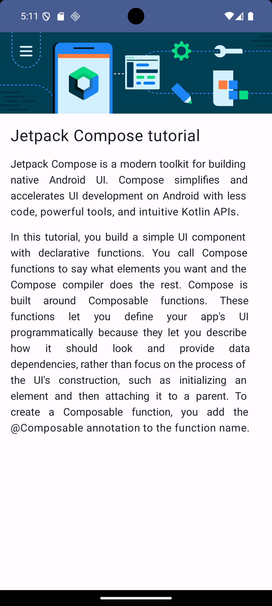

# 📚 Learn Together – Artigo sobre o Compose

Aplicativo Android desenvolvido com **Jetpack Compose** como parte de um codelab oficial do Google.

O app **Learn Together** apresenta um artigo informativo sobre o Jetpack Compose, demonstrando como criar layouts simples e organizados utilizando UI declarativa no Android.

---

## 📸 Preview do Aplicativo

<p align="center">
  
</p>

---

## 🚀 Tecnologias Utilizadas

- Kotlin
- Jetpack Compose
- Material Design
- Android SDK
- Gradle

---

## 🧠 Conceitos Praticados

- Funções `@Composable`
- Organização de layout com Compose
- Estilização de textos
- Estruturação de conteúdo em tela
- UI declarativa

---

## ▶️ Como Executar o Projeto

### Pré-requisitos
- Android Studio instalado
- Emulador Android ou dispositivo físico configurado

### Passo a passo

```bash
git clone https://github.com/sinngjpeg/NOME-DO-REPOSITORIO.git
```

1. Abra o projeto no Android Studio
2. Aguarde a sincronização do Gradle
3. Execute o app em um emulador ou dispositivo físico

## 🎯 Objetivo do Projeto

Este projeto foi criado com o objetivo de praticar a construção de interfaces utilizando Jetpack Compose, reforçando conceitos fundamentais da UI declarativa no Android.

🔗 Link do Codelab
- 📘 [Artigo sobre o Compose](https://developer.android.com/codelabs/basic-android-kotlin-compose-composables-practice-problems?authuser=1&hl=pt-br&continue=https%3A%2F%2Fdeveloper.android.com%2Fcourses%2Fpathways%2Fandroid-basics-compose-unit-1-pathway-3%3Fauthuser%3D1%26hl%3Dpt-br%23codelab-https%3A%2F%2Fdeveloper.android.com%2Fcodelabs%2Fbasic-android-kotlin-compose-composables-practice-problems#1)

